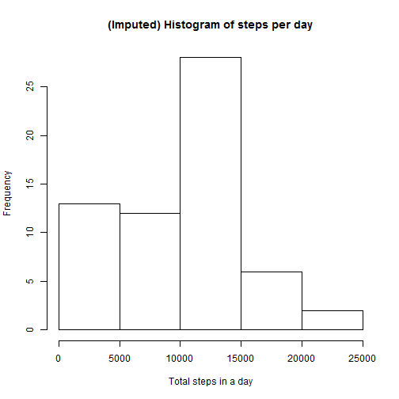
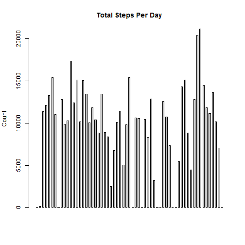
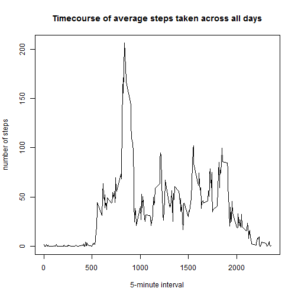
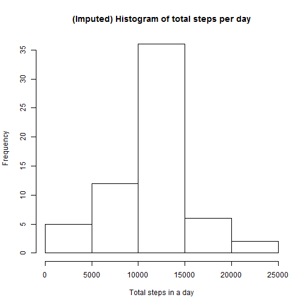
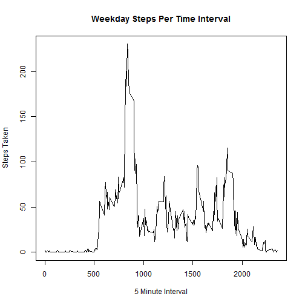
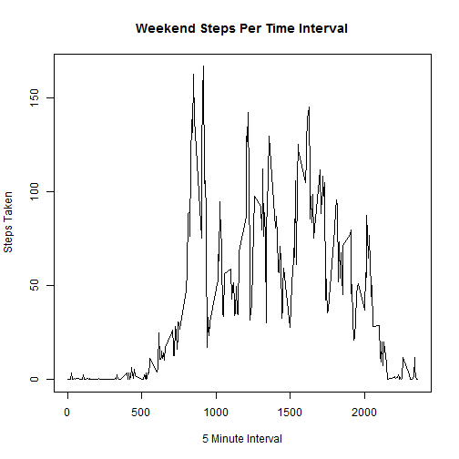

## **Loading and preprocessing the data**
This is how the data is loaded and processed:


```r
setwd("C:/Users/Joshua/RepData_PeerAssessment1")

dat <- read.csv("activity.csv")

summary(dat)
```

```
##      steps                date          interval     
##  Min.   :  0.00   2012-10-01:  288   Min.   :   0.0  
##  1st Qu.:  0.00   2012-10-02:  288   1st Qu.: 588.8  
##  Median :  0.00   2012-10-03:  288   Median :1177.5  
##  Mean   : 37.38   2012-10-04:  288   Mean   :1177.5  
##  3rd Qu.: 12.00   2012-10-05:  288   3rd Qu.:1766.2  
##  Max.   :806.00   2012-10-06:  288   Max.   :2355.0  
##  NA's   :2304     (Other)   :15840
```
No further transformation of the data is necessary. 

## **What is the mean total number of steps taken per day?** 


```r
aggedtotal <- aggregate(dat$steps, by=list(dat$date), FUN  = sum, na.rm = TRUE)
```

Average steps taken:

```r
mean(aggedtotal$x)
```

```
## [1] 9354.23
```

Median steps taken:

```r
median(aggedtotal$x)
```

```
## [1] 10395
```

```r
hist(aggedtotal$x, main="(Imputed) Histogram of steps per day", xlab="Total steps in a day")
```

 


The total number of steps taken per day is:


```r
aggedmean <- aggregate(dat$steps, by=list(dat$date), FUN = sum, na.rm = TRUE)

barplot(aggedmean$x, ylab = "Count", main = "Total Steps Per Day",  space=1)
```

 


## **What is the average daily activity pattern?**


```r
aggedintervalmean <- aggregate(dat$steps, by=list(dat$interval), FUN = mean, na.rm = TRUE)

plot(aggedintervalmean, type = "l", main = "Timecourse of average steps taken across all days", ylab = 
       "number of steps", xlab = "5-minute interval")
```

 

```r
max(aggedintervalmean$x)
```

```
## [1] 206.1698
```

```r
maxname <- which.max(aggedintervalmean$x)

names <- aggedintervalmean[maxname, ]

names$Group.1
```

```
## [1] 835
```

The maxinum number of steps is during the **835** interval, at **206.17** steps on average. 

## **Imputing missing values**

Calculate the number of missing values

```r
totalnas <- sum(is.na(dat$steps))

totalnas
```

```
## [1] 2304
```


Perform the imputation by replacing NA's with the average for that associated interval. 


```r
for (i in 1:nrow(dat)){
  if (is.na(dat$steps[i])){
    interval_val <- dat$interval[i]
    row_id <- which(aggedintervalmean$Group.1 == interval_val)
    steps_val <- aggedintervalmean$x [row_id]
    dat$steps[i] <- steps_val
  }
}

table_date_steps_imputed <- aggregate(steps ~ date, dat, sum)

hist(table_date_steps_imputed$steps, main="(Imputed) Histogram of total steps per day", xlab="Total steps in a day")
```

 

```r
mean(table_date_steps_imputed$steps)
```

```
## [1] 10766.19
```

```r
median(table_date_steps_imputed$steps)
```

```
## [1] 10766.19
```

## **Are there differences in activity patterns between weekdays and weekends?**


```r
dayofweek <- function(dat) {
    if (weekdays(as.Date(dat)) %in% c("Saturday", "Sunday")) {
        "weekend"
    } else {
        "weekday"
    }
}
dat$daytype <- as.factor(sapply(dat$date, dayofweek))
```


```r
weekend <- subset(dat, dat$daytype == "weekend")
weekday <- subset(dat, dat$daytype == "weekday")

weekday <- aggregate(steps ~ interval, data=weekday, FUN = mean )
plot(weekday$steps ~ weekday$interva, type = "l", main = "Weekday Steps Per Time Interval", xlab = "5 Minute Interval", ylab = "Steps Taken")
```

 

```r
weekend <- aggregate(steps ~ interval, data=weekend, FUN = mean )
plot(weekend$steps ~ weekend$interva, type = "l", main =  "Weekend Steps Per Time Interval", xlab = "5 Minute Interval", ylab = "Steps Taken")
```

 

**Yes, there does appear to be a difference in the activitey when comparing weekends to weekdays. **

